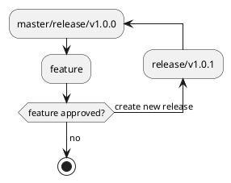
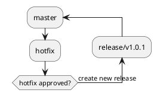
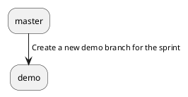
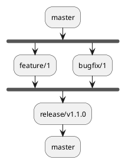
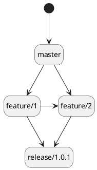

# Git branches & git flow

# Introduction
In the sections below, one can find our set of recommendations for setting up a robust & streamlined CI/CD git glow on BitBucket.

# Branches
In the source code lifecycle there are 2 kinds of git branches: permanent and work/working branches. Permanent branches are always present in the git repository are main sources of code and its increments delivered by teams over time. The work branches are transient branches created with a sole purpose of adding a code increment to the permanent git branch.

## Permanent Branch
There are 2 permanent git branches: development and master. Please note that there is no permanent QA/test branch.
|No|Name|Purpose|Merge sources|Direct commit|Env|Merge policy|
|-|-|-|-|-|-|-|
|1 | master | Production branch, only stable increments | release | Forbidden | prod | merge commit |

## Work Branches
There are 5 types of working branches: feature, bugfix, release, hotfix and demo.

|No|Name|Purpose| Branched from | Merge targets | Name example | Env | Merge policy |
|-|-|-|-|-|-|-|-|
|1 | demo | Ongoing development branch, use to demo the sprint development | master | none | demo/sprint-9 | dev, QA | merge commit |
| 2 | feature | Adding new bussiness logic features | master | demo, release | feature/IOT-1234-add-stuff | dev | merge commit |
| 3	| bugfix | Fixing bugs reported by QA team on QA envs and bugs found by devs in DEV env | master, release | demo, release | bugfix/IOT-1234-repaired-stuff | dev | merge commit |
| 3 | hotfix | Fixing bugs reported by users on PROD | master | release | hotfix/IOT-1234-repaired-stuff | dev, QA | merge commit |
| 4 | release | Preparing and stabilizing releases of code increments to PROD | master | master | release/sprint-9 | dev, QA, Pre-Prod |merge commit |

# Normal work flow

## New feature/bugfix

When starting a new feature or bugfix, always create a branch out of the master branch, or release branch, if a specific release is being targeted

## Hotfix

For each Hotfix, create a new branch from the master branch called hotfix/ticketNumber-description

## Sprint end

If a demo is needed, create a new demo branch from the master and merge all the feature that need to be demo.

## New release

## Dependent features

In case `feature/2` is approved but not `feature/1` they cannot be released until `feature/1` is approved

