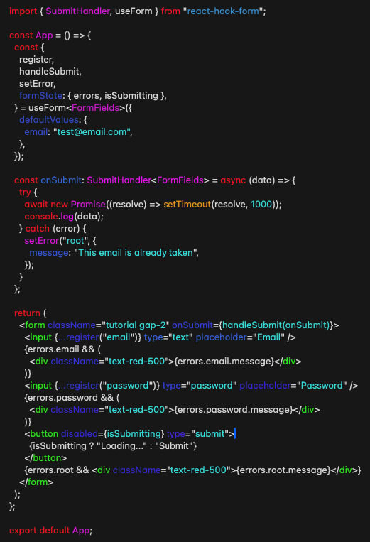

# Using React Hook Forms

This lib is based on hooks, so, not usable on the base components from a Form, but expected to be used on specific cases for example, on a login, on a submit button from an actual Form to the backend.

## Example code:

Use `import { SubmitHandler, useForm } from 'react-hook-form'` to start working with React-Hook-Form Library.

`const form = useForm()` is used to call the hook from React Hook Form.

After that we can destructure the 'form' in to other properties:

- `...register` Is used to connect a propriety in the input field to be registered on submission of a Form.
  - `{required: true OR required: "error message here"}` which will avoid the submission of the form.
  - `pattern`for example `pattern: /^[a-z0-9._%+-]+@[a-z0-9.-]+\.[a-z]{2,4}$/,` which will make sure that the email input field follows it.
  - Additionally, you can also add `minLength` where you define the minimum number of characters for an input field.
  - `validate` can take a function, for example `validate: (value) => value.includes('@')` to validate the input field.
- `handleSubmit` It will prevent the default behavior from the form, and does the work of validating the work from the handler (which will be an argument for this function from RHF)
- `formState: { errors }` is another function that takes an object `errors` for error message on validation. For the error message itself, it will be on the `required: "error message here"` that this will work, as mentioned above. For `minLength` we can extend it as follows, `minLength: { value : 8, message: 'insert message here'}`

  - Still inside `formState` we can also add `isSubmitting` when we want to use an async function when the form is submitting to the backend. This can be used for example on the submit button, `<button disable={isSubmitting} type='submit'>Submit</button>` in this case the button will be disabled while is submiting the form.

- `const onSubmit: SubmitHandler<FormFields> = (data)=> {console.log(data);}` Will be our handler to receive data from Form Event.
