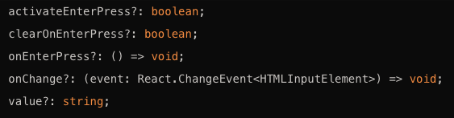
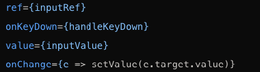

# 'useInput' Hook

You can use this hook by importing on the component you want as follows - `import { useActivateOnEnter } from '../hooks/useActivateOnEnter/useActivateOnEnter` - after that, the props should be added either on the `interface` or the `type` of the component:
 also add them to the component props as well.

Then I suggest that you call them as shown below:

`const { value: inputValue, setValue, inputRef, handleKeyDown } = useActivateOnEnter({ activateEnterPress, clearOnEnterPress, onEnterPress, onChange, Value, });`

- `activateEnterPress` will be a prop that can be activated on a component to submit on enter press
- `clearOnEnterPress` will be another prop that can be activated on a component to clear the Input field on enter press
- `onEnterPress` is a void function that can be used to run another function that needs to run on enter press (needs to be used alongside `activateEnterPress`)

As for the props in useInput:

- `value: inputValue` binds the current state value to the input field
- `setValue` Updates the state when the input value changes (updates the `inputValue` state)
- `inputRef` Provides a reference to the input field for direct manipulation
- `handleKeyDown` Adds a custom behaviour for keydown events, in this case, the Enter key

On the component, you to return the props, you can simply:

